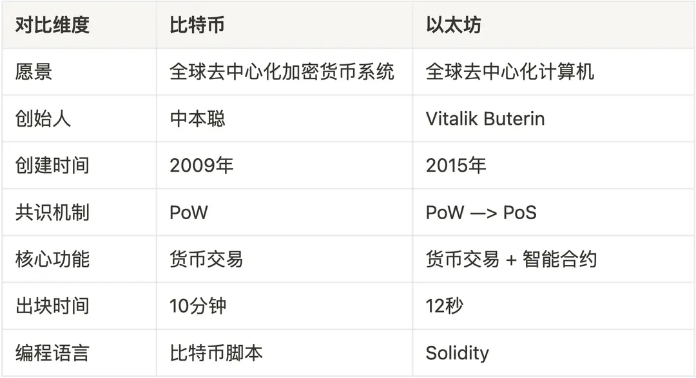

#

## 简介

开源的、去中心化的区块链平台，它不仅支持原生的加密货币：以太币（ ETH ），还提供了一个运行去中心化应用程序（ DApps ）的生态系统。应用程序通过智能合约来实现，运行在以太坊虚拟机（ EVM ）上。如果说比特币是一个全球分布式账本，那么以太坊就是一个全球分布式计算机。

## 智能合约

智能合约是以太坊平台的灵魂所在，它们是存储在区块链上的、可以自动执行的代码，代码中包含了所有的运行规则。当预设的条件被满足时，合约便会自动执行相关的功能。

## 区别

